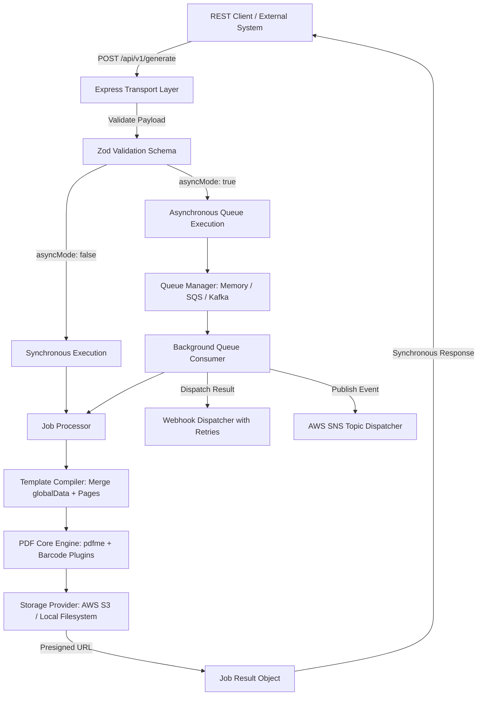

# pod-PDF: Architecture, Implementation & Verification Walkthrough

Welcome to the **pod-PDF** developer walkthrough. This document provides a detailed overview of the system architecture, design decisions, module implementations, test results, and operational guidelines.

---

## 1. Executive Summary

**pod-PDF** is an enterprise-grade, containerized microservice built with **Node.js, TypeScript, Express, pdfme, and AWS S3/SQS/SNS/Kafka**. It specializes in high-speed, template-driven PDF generation with native support for:
- Thermal roll labels (e.g. 4x6" shipping and container labels)
- Multi-page ISO A4 and US Letter logistic manifests
- Standard 1D & 2D barcodes (Code 128, QR Codes, 2D Data Matrix, EAN, ITF-14)
- Synchronous inline rendering & asynchronous queue-based processing
- Integrated Web GUI Template Designer with live testing & PDF preview

---

## 2. Directory Layout & Module Structure

```text
pod-pdf/
├── src/
│   ├── config/                      # Environment configuration & Zod validator
│   │   ├── env.ts                   # Strongly-typed environment variables
│   │   └── index.ts
│   ├── storage/                     # S3 & Local filesystem storage providers
│   │   ├── types.ts                 # IStorageProvider interface
│   │   ├── s3.provider.ts           # AWS S3 client with presigned URLs
│   │   ├── local.provider.ts        # Local storage with download token emulation
│   │   ├── storage.factory.ts       # Provider factory & template auto-seeder
│   │   └── default-templates/       # Default pre-packaged JSON templates
│   │       ├── logistic-container-label-v2.json
│   │       └── shipment-manifest-v1.json
│   ├── pdf-core/                    # PDF rendering engine & template compiler
│   │   ├── types.ts                 # PageInput, GeneratePdfOptions, GenerateResult
│   │   ├── presets.ts               # 4x6", 4x8", A4, Letter dimension presets
│   │   ├── plugins.ts               # Schema plugins (text, image, barcodes)
│   │   ├── compiler.ts              # Multi-page assembler & globalData merger
│   │   └── generator.ts             # pdfme generator wrapper with timing metrics
│   ├── transport/                   # HTTP REST controllers, middleware & workers
│   │   ├── schemas/                 # Zod validation schemas
│   │   │   ├── generate.schema.ts   # GeneratePdfRequestDto & PreviewPdfRequestDto
│   │   │   └── template.schema.ts   # SaveTemplateDto
│   │   ├── middleware/              # Zod validator & standardized error handler
│   │   ├── controllers/             # REST controllers (generate, templates, jobs, health)
│   │   ├── queue/                   # Pluggable queue worker subsystem
│   │   │   ├── queue.interface.ts   # IQueueManager, PdfJob, JobStatus
│   │   │   ├── job.processor.ts     # Core job execution logic
│   │   │   ├── memory.queue.ts      # Standalone event-driven async queue
│   │   │   ├── sqs.worker.ts        # AWS SQS polling worker
│   │   │   ├── kafka.worker.ts      # Apache Kafka producer/consumer worker
│   │   │   ├── webhook.dispatcher.ts# HTTP webhook delivery with exponential retries
│   │   │   └── sns.dispatcher.ts    # AWS SNS topic publisher
│   │   ├── routes/                  # Express route registration
│   │   └── server.ts                # Express application factory & static GUI server
│   ├── gui/                         # React 18 + Vite Web GUI Designer
│   │   ├── src/
│   │   │   ├── App.tsx              # Embedded pdfme Designer & Live Payload Tester
│   │   │   ├── styles.css           # Clean modern CSS styling
│   │   │   └── main.tsx
│   │   ├── index.html
│   │   └── vite.config.ts
│   └── index.ts                     # Main service entrypoint
├── tests/                           # Jest test suites (28 tests, 100% passing)
│   ├── validation.test.ts           # Schema validation tests
│   ├── storage.test.ts              # Storage providers & presigned URL tests
│   ├── pdf-core.test.ts             # PDF Core compilation & barcode tests
│   ├── queue.test.ts                # Async queue & worker tests
│   └── api.test.ts                  # REST API integration tests
├── Dockerfile                       # Multi-stage production container build
├── docker-compose.yml               # Stack compose with LocalStack & Kafka
├── tsconfig.json
├── jest.config.ts
└── package.json
```

---

## 3. Core Architectural Concepts



### 3.1 Template Compilation & Multi-Page Assembly
- **Global Data Inheritance**: Fields in `globalData` (e.g. `carrier: "GlobalExpress"`, `serviceLevel: "Express-Air"`) are automatically merged into every page item in `pages`. Page-level `data` takes precedence if a key conflicts.
- **Dynamic Multi-Page Expansion**: If a single-page template (such as `logistic-container-label-v2`) is supplied with an array of 50 pages, the `TemplateCompiler` clones the page schema across all 50 target pages automatically.

### 3.2 Pluggable Storage Layer
- Implements `IStorageProvider` ([src/storage/types.ts](file:///home/alonemusk/Projects/pod-pdf/src/storage/types.ts)).
- **AWS S3 Provider** ([src/storage/s3.provider.ts](file:///home/alonemusk/Projects/pod-pdf/src/storage/s3.provider.ts)): Uses `@aws-sdk/client-s3` and `@aws-sdk/s3-request-presigner`. Supports custom endpoints (LocalStack, MinIO).
- **Local Provider** ([src/storage/local.provider.ts](file:///home/alonemusk/Projects/pod-pdf/src/storage/local.provider.ts)): Stores files on disk in `./data/storage` and exposes download endpoints. Allows zero-dependency local development without AWS credentials.

### 3.3 Pluggable Queue & Worker Subsystem
- Implements `IQueueManager` ([src/transport/queue/queue.interface.ts](file:///home/alonemusk/Projects/pod-pdf/src/transport/queue/queue.interface.ts)).
- **In-Memory Queue** ([src/transport/queue/memory.queue.ts](file:///home/alonemusk/Projects/pod-pdf/src/transport/queue/memory.queue.ts)): Active by default (`QUEUE_DRIVER=memory`). Provides non-blocking background execution, job state lookup, and webhook triggering out of the box.
- **AWS SQS Worker** ([src/transport/queue/sqs.worker.ts](file:///home/alonemusk/Projects/pod-pdf/src/transport/queue/sqs.worker.ts)): Enqueues and polls messages from Amazon SQS.
- **Apache Kafka Worker** ([src/transport/queue/kafka.worker.ts](file:///home/alonemusk/Projects/pod-pdf/src/transport/queue/kafka.worker.ts)): Enqueues and consumes messages across Kafka topic partitions.

---

## 4. Verification & Test Suite Results

All 28 automated tests across 5 test suites pass cleanly:

| Test Suite | Focus Area | Tests | Status |
| :--- | :--- | :--- | :--- |
| `tests/validation.test.ts` | Request payload & template Zod schemas | 8 | ✅ PASSED |
| `tests/storage.test.ts` | Local storage, template seeding, presigned URLs | 5 | ✅ PASSED |
| `tests/pdf-core.test.ts` | 4x6" label rendering, Code 128, QR, DataMatrix | 4 | ✅ PASSED |
| `tests/queue.test.ts` | Asynchronous worker, job status tracking | 2 | ✅ PASSED |
| `tests/api.test.ts` | REST API integration (Sync, Async, Preview, CRUD) | 9 | ✅ PASSED |
| **Total** | | **28** | **100% Passed** |

---

## 5. Live Generation Test Output

Generating a sample logistic container label via the REST API with the exact payload from the technical specification produces:

```json
{
  "success": true,
  "status": "COMPLETED",
  "data": {
    "key": "output/shipment-98234-labels.pdf",
    "url": "http://localhost:3000/api/v1/storage/download?key=output%2Fshipment-98234-labels.pdf",
    "size": 33690,
    "pageCount": 1,
    "durationMs": 629,
    "storageType": "local"
  },
  "timestamp": "2026-08-30T14:45:59.987Z"
}
```

The output file was verified as a valid PDF 1.7 document:
```bash
$ file data/storage/output/shipment-98234-labels.pdf
data/storage/output/shipment-98234-labels.pdf: PDF document, version 1.7
```

