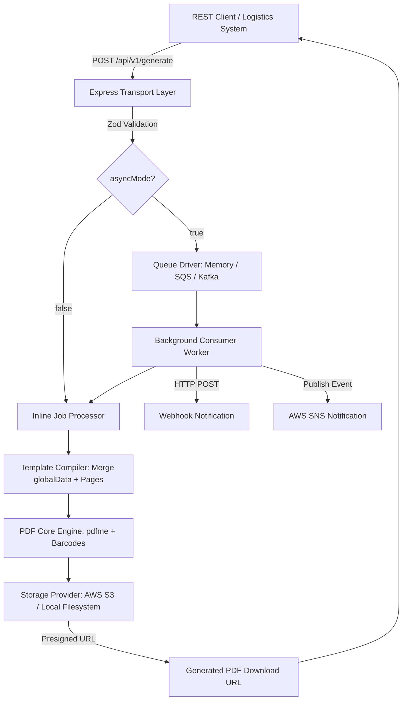

# pod-PDF: Enterprise Logistic Label & Multi-Page PDF Microservice

[](https://nodejs.org)
[](https://www.typescriptlang.org/)
[](https://opensource.org/licenses/MIT)

**pod-PDF** is a containerized microservice designed for high-throughput, template-driven PDF generation at enterprise scale. It provides robust capabilities for generating multi-page documents, custom thermal label sizes (e.g., 4x6 inch rolls), and complex logistic elements including standard barcodes (Code 128, Code 39, ITF-14, EAN/UPC), QR codes, and 2D Data Matrices.

The service integrates **pdfme** for visual template design and execution, **AWS S3** for persistent storage with pre-signed URLs (with automatic zero-dependency local disk fallback), and supports both **synchronous REST APIs** and **asynchronous message queues** (Kafka, AWS SQS, and built-in workers).

---

## 1. Quick Start

### 1.1 Local Development
```bash
# 1. Install dependencies
npm install

# 2. Build Web GUI & Backend
npm run build:gui
npm run build

# 3. Start the service
npm start
```

- **REST API**: `http://localhost:3000/api/v1`
- **Web GUI Template Designer**: `http://localhost:3000/designer`
- **Health Check**: `http://localhost:3000/api/v1/health`

### 1.2 Docker & Docker Compose
```bash
# Run microservice with LocalStack (S3, SQS, SNS emulation)
docker compose up --build

# Run with Apache Kafka enabled
docker compose --profile kafka up --build
```

---

## 2. Architecture & Data Structures



### 2.1 REST API Request Payload Schema

```json
{
  "templateName": "logistic-container-label-v2",
  "outputFilename": "shipment-98234-labels.pdf",
  "asyncMode": false,
  "webhookUrl": "https://api.internal.system/v1/pdf-callback",
  "globalData": {
    "carrier": "GlobalExpress",
    "serviceLevel": "Express-Air"
  },
  "pages": [
    {
      "pageIndex": 0,
      "data": {
        "containerId": "CONT-2026-9901",
        "destinationHub": "BOM-T3",
        "weight": "450kg",
        "barcode_tracking": "1Z9999999999999999",
        "qrcode_manifest": "https://logistics.internal/manifest/9901",
        "matrix_code": "SKU:A99-B|BATCH:12|LOC:Z4"
      }
    }
  ]
}
```

### 2.2 Processing Modes
- **Synchronous Mode (`asyncMode: false`)**: Processes generation inline and returns a JSON response containing the S3 pre-signed URL of the generated PDF. Recommended for single documents or immediate response workflows.
- **Asynchronous Mode (`asyncMode: true`)**: Pushes job payload to a message queue (Memory, SQS, or Kafka) and immediately returns an accepted status with `jobId`. Background workers consume the message, generate the PDF, upload to S3, and dispatch notifications to `webhookUrl` and AWS SNS.

---

## 3. Technology Stack

- **PDF Engine & Designer**: `pdfme` (`@pdfme/generator`, `@pdfme/schemas`, `@pdfme/ui`, `@pdfme/common`)
- **Backend Runtime**: Node.js 18+ / TypeScript / Express / esbuild
- **Validation**: Zod schema validation
- **Cloud Storage**: AWS S3 (`@aws-sdk/client-s3`, `@aws-sdk/s3-request-presigner`) + Local Filesystem Fallback
- **Messaging Queues**: Apache Kafka (`kafkajs`), AWS SQS (`@aws-sdk/client-sqs`), AWS SNS (`@aws-sdk/client-sns`), and in-memory event queues
- **Containerization**: Multi-stage Docker & Docker Compose with LocalStack

---

## 4. Environment Configuration

```env
# Server
PORT=3000
NODE_ENV=development

# Storage ('s3' or 'local')
STORAGE_TYPE=local
LOCAL_STORAGE_DIR=./data/storage

# AWS S3 (when STORAGE_TYPE=s3)
AWS_REGION=us-east-1
AWS_ACCESS_KEY_ID=your_access_key
AWS_SECRET_ACCESS_KEY=your_secret_key
AWS_S3_BUCKET=pod-pdf-storage-bucket
AWS_S3_KEY_PREFIX_TEMPLATES=templates/
AWS_S3_KEY_PREFIX_OUTPUT=output/
AWS_S3_PRESIGNED_EXPIRES_IN=3600
# AWS_ENDPOINT=http://localhost:4566 # for LocalStack or MinIO

# Queue Driver ('memory', 'sqs', 'kafka')
QUEUE_DRIVER=memory

# Kafka (when QUEUE_DRIVER=kafka)
KAFKA_BROKERS=localhost:9092
KAFKA_CLIENT_ID=pod-pdf-service
KAFKA_TOPIC_JOBS=pdf-generation-jobs
KAFKA_GROUP_ID=pod-pdf-group

# AWS SQS & SNS (when QUEUE_DRIVER=sqs)
SQS_QUEUE_URL=https://sqs.us-east-1.amazonaws.com/123456789012/pdf-jobs
SNS_TOPIC_ARN=arn:aws:sns:us-east-1:123456789012:pdf-job-completed
```

---

## 5. API Endpoints Overview

| Method | Endpoint | Description |
| :--- | :--- | :--- |
| `POST` | `/api/v1/generate` | Generate PDF (Synchronous or Asynchronous) |
| `POST` | `/api/v1/preview` | Instant live preview (Base64 data URL or binary stream) |
| `GET` | `/api/v1/jobs/:jobId` | Query status and result of asynchronous job |
| `GET` | `/api/v1/jobs` | List recent asynchronous jobs |
| `GET` | `/api/v1/templates` | List all available templates |
| `GET` | `/api/v1/templates/:name` | Retrieve template JSON definition |
| `POST` | `/api/v1/templates/:name` | Create or update template JSON definition |
| `DELETE`| `/api/v1/templates/:name` | Delete template |
| `GET` | `/api/v1/presets` | List standard label and page dimension presets |
| `GET` | `/api/v1/health` | Healthcheck and service diagnostics |
| `GET` | `/api/v1/storage/download` | Download generated file from local storage |

---

## 6. Testing & Quality Assurance

```bash
# Run unit & integration test suites
npm test

# Run tests with coverage reporting
npm run test:coverage
```

---

## 7. Documentation & Guides

- [WALKTHROUGH.md](file:///home/alonemusk/Projects/pod-pdf/WALKTHROUGH.md): Architecture overview, design decisions, and test verification report.
- [docs/DEVELOPER_GUIDE.md](file:///home/alonemusk/Projects/pod-pdf/docs/DEVELOPER_GUIDE.md): Developer guide, curl API examples, how to add custom plugins, storage providers, and message queue drivers.
